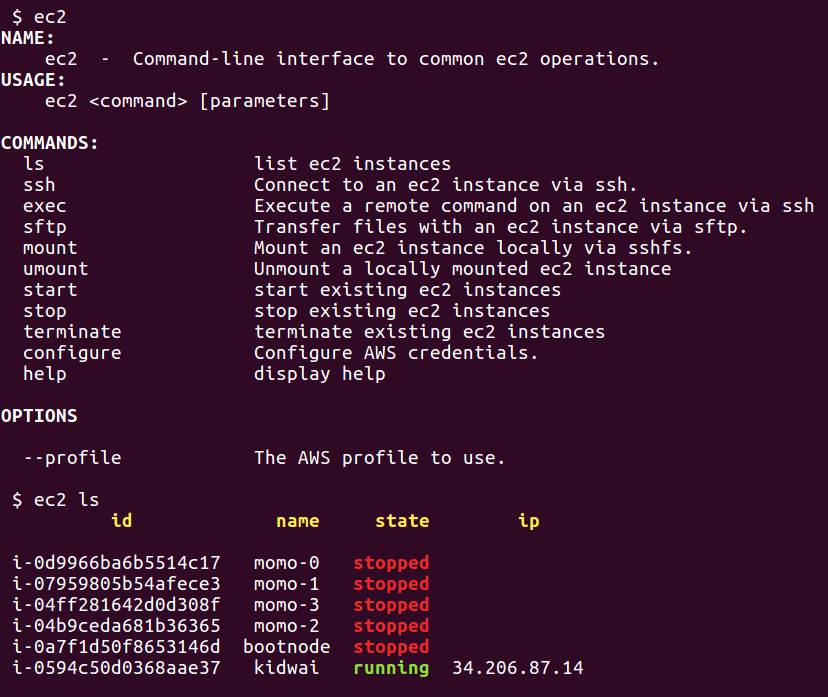

# ec2-tool

***





***

### Install

```
$ npm install -g ec2-tool
$ ec2 configure
  profile  (default) 
  region  (us-east-1) 
  access key id  "access_key"
  secret access key "secret_access_key"  
  ssh keys  
```

If you do not have an access key id or secret access key, go to [security credentials](https://console.aws.amazon.com/iam/home?region=us-east-1#/security_credential) in the amazon console to find or create a key pair. Note, however, you can still use commands requiring only ssh keys for operation without these.


### Usage


```
$ ec2
NAME:
    ec2  -  Command-line interface to common ec2 operations.
USAGE:
    ec2 <command> [parameters]

COMMANDS:
  ls                   list ec2 instances
  ssh                  Connect to an ec2 instance via ssh.
  sftp                 Transfer files over sftp with an ec2 instance
  mount                Mount an ec2 instance locally via sshfs.
  umount               Unmount a locally mounted ec2 instance
  start                start existing ec2 instances
  stop                 stop existing ec2 instances
  terminate            terminate existing ec2 instances
  configure            Configure AWS credentials.
  help                 display help

OPTIONS

  --profile            The AWS profile to use.

```


### Commands

***


#### configure


Configure default options.


```
 $ ec2 configure

  profile  (default) 
  region  (us-east-1) 
  access key id  "access_key"
  secret access key "secret_access_key"  
  ssh keys  

```


***


#### ls 

Lists ec2 instances for the authenticated user.


```sh
          id             name     state        ip      

 i-0d9966ba6b5514c17   momo-0   stopped               
 i-07959805b54afece3   momo-1   stopped               
 i-04ff281642d0d308f   momo-3   stopped               
 i-04b9ceda681b36365   momo-2   stopped               
 i-0a7f1d50f8653146d  bootnode  stopped               
 i-0594c50d0368aae37   kidwai   running  34.206.87.14 
```

***

##### ssh

Open an ssh connection with an ec2 instance.

```sh
$ ec2 ssh -n kidwai

ubuntu@ip-172-31-27-62:~$ 
```

To use a keyfile not contained in the directory specified in the configuration file, use the `-i` flag as usual.


Execute a command remotely and return the output

```sh
$ ec2 ssh -n kidwai -c "df -h"
Filesystem      Size  Used Avail Use% Mounted on
udev            2.0G     0  2.0G   0% /dev
tmpfs           396M   41M  355M  11% /run
/dev/xvda1       49G   39G  9.5G  81% /
tmpfs           2.0G     0  2.0G   0% /dev/shm
tmpfs           5.0M     0  5.0M   0% /run/lock
tmpfs           2.0G     0  2.0G   0% /sys/fs/cgroup
tmpfs           396M     0  396M   0% /run/user/1000
```
***

##### sftp

Open an sftp session with an ec2 instance.

```sh
$ ec2 sftp -n website
Connected to 39.252.82.0.
sftp> get -r /logs
```


***


#### mount

Mount the instance named "website".


```sh
 $ ec2 mount -n website
 Mounted 39.252.82.0 to /mnt/ssd/software/nodejs/ec2-tool/website
```

Mount the instance named "website" to a custom mount point.

```sh
$ ec2 mount -n website -m /mnt/website
```


#### umount

Unmount the instance named website


```sh
 $ ec2 umount -n website
Unmounted 39.252.82.0 from /mnt/ssd/software/nodejs/ec2-tool/website
```

***

#### start,stop,terminate

Start,stop, or terminate an ec2 instance.

```sh
 $ ec2 stop -n website
 $ ec2 start -n light
 $ ec2 terminate -i i-34b4b5b3b3
```

### Profiles


Multiple profiles can be configured then supplied with '--profile':

```sh
$ ec2 configure 
 profile: (default)  test
 region:  (us-east-1) us-east-1
 access key id "access_key_id"
 secret access key "secret_access_key"


$ ec2 --profile test ssh -n test -c "ps aux | grep geth"
ubuntu     516  1.2 10.6 1965968 431152 ?      Sl   Jun23 313:17 geth --testnet --rpc --port 30304 --rpcport 8547 --password /dev/fd/63 --unlock 0
ubuntu    9497  0.0  0.0  11240  2940 ?        Ss   05:38   0:00 bash -c ps aux | grep geth
ubuntu    9499  0.0  0.0  12948   976 ?        S    05:38   0:00 grep geth
```